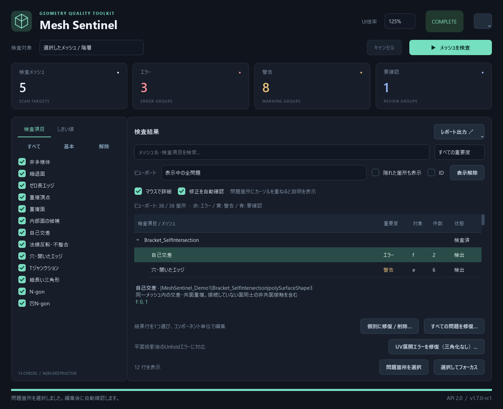
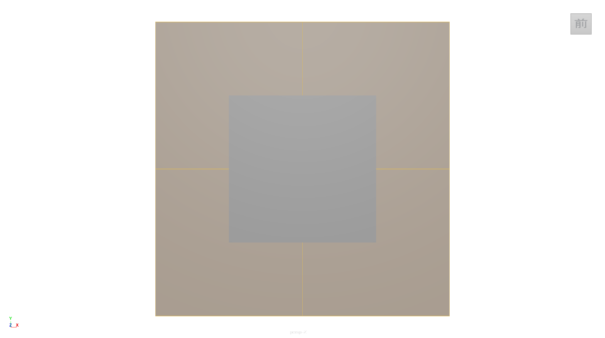
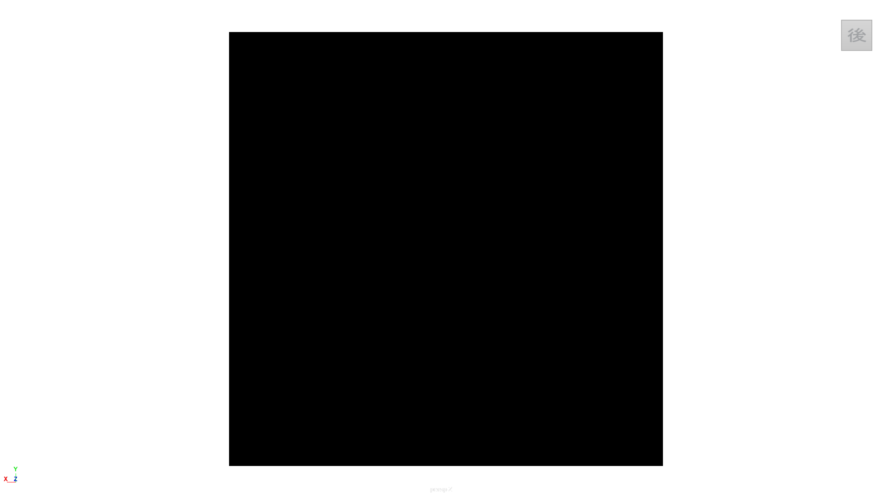
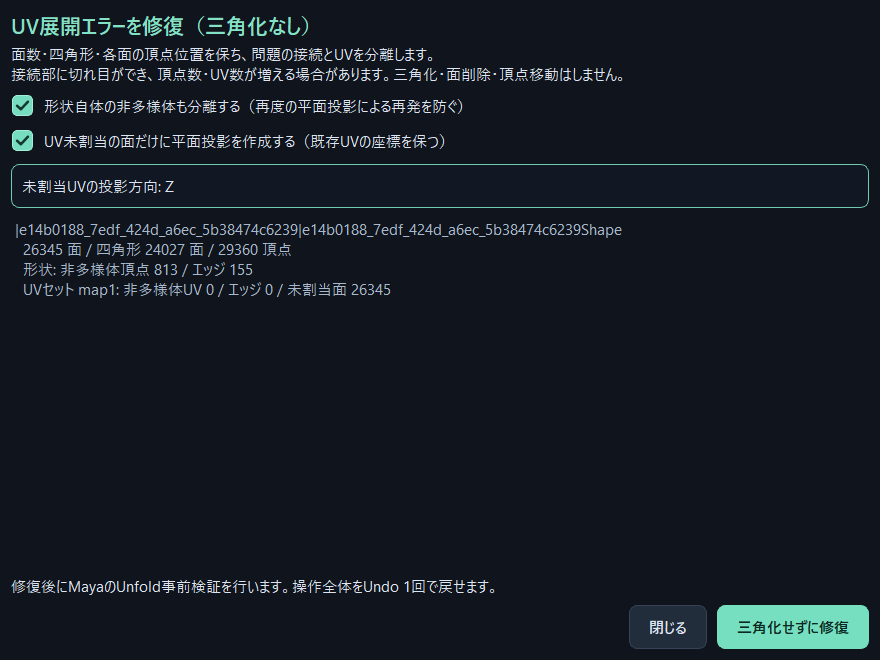
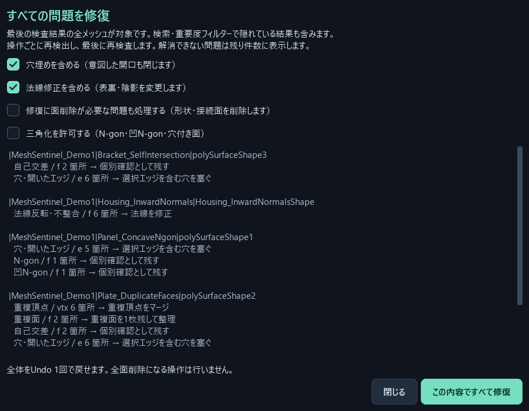
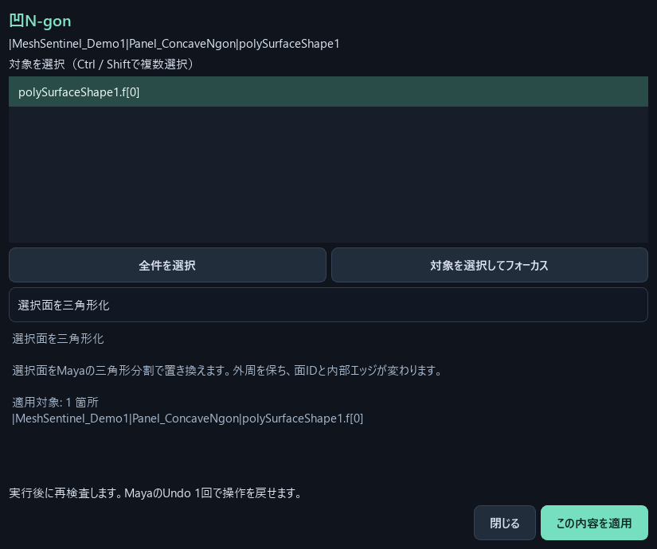
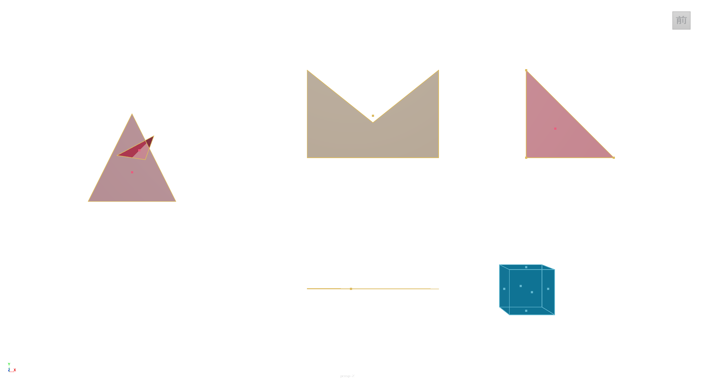
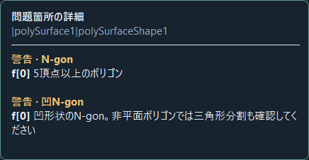

# Mesh Sentinel

Maya用のメッシュ検査・個別修復ツール。検査だけでは形状を変更しません。バージョン **1.7.1-rc1**。

ダークテーマのQt UI、13種類の検査、問題箇所の選択・ビューポート表示、UI表示倍率、しきい値保存、キャンセル、JSON / CSV / HTMLレポート出力を備えます。検査と修復は別操作です。



## 起動

1. ZIPを展開し、`MeshSentinel`フォルダーを任意の固定場所に置きます。
2. `install.py`を**Mayaのビューポートにドラッグ＆ドロップ**します。
3. 画面右上の「•••」→「シェルフに登録」で、次回からシェルフボタンで起動できます。

ドラッグ＆ドロップを使わない場合は、MayaのScript Editorの **Python** タブで次を実行します。パスは展開先に置き換えてください。

```python
import sys
root = r"D:\Tools\MeshSentinel"
if root not in sys.path:
    sys.path.insert(0, root)
import mesh_sentinel
mesh_sentinel.show()
```

Maya以外の通常Pythonで`show()`は動作しません。pipインストールは不要です。Mayaに付属するPySideとPython APIを使います。シェルフ登録後にフォルダーを移動した場合は、新しい場所から起動して再登録します。同じシェルフの既存ボタンは更新されます。

モジュール管理を使うスタジオ向けには`MeshSentinel.mod`も同梱しています。`.mod`のルートを展開先に合わせて、既存のMayaモジュール検索パスで管理してください。

### 開いているMayaに更新を反映

以前のウィンドウが開いている場合は、検査が終わってから`install.py`を再度ドラッグ＆ドロップするか、Pythonタブで次を実行します。古い結果は破棄してウィンドウを作り直します。元のシーンは維持します。

```python
import importlib, mesh_sentinel
importlib.reload(mesh_sentinel)
mesh_sentinel.reload_ui()
```

## UIを拡大する

画面右上の **「UI倍率」** で100 / 125 / 150 / 175 / 200%を選択します。初期値は125%。文字、ボタン、余白、チェックボックス、結果表をまとめて拡大し、設定を次回起動時も保持します。Maya全体のUI倍率やOSのDPI設定は変更しません。

画面に収まらない場合はウィンドウ内にスクロールバーが出るため、200%でも操作項目へ移動できます。ウィンドウ自体の最大化・サイズ変更も利用できます。

## ビューポートに問題箇所を表示する

検査が終わると、Viewport 2.0上に検出した箇所を自動表示します。**赤: エラー、黄: 警告、青: 要確認**です。

- 面: 薄い塗りと細い輪郭。中心の点は縮退・無効な面だけに表示。
- エッジ: 細いライン。完全なゼロ長の場合は点も表示。
- 頂点: 視認しやすいサイズの点。
- 「表示中の全問題」: 結果表の検索・重要度フィルターに合う問題を表示。
- 「選択した結果のみ」: 結果表で選んだ行だけを表示。複数選択も可能。
- 「隠れた箇所も表示」: 標準はオフ。裏向きの面と、その面だけに属するエッジ・頂点を隠し、手前の形状による遮蔽も反映します。オンにすると内部・裏側も透かして確認できます。
- 「ID」: コンポーネントIDを最大60個表示。文字の見え方は深度・画角に依存します。
- 「表示解除」: 描画を消します。再表示するにはモードを切り替えます。

同じコンポーネントに複数の重要度がある場合は高い重要度を採用します。面とその境界エッジが別の問題に該当する場合は、それぞれの色で描画します。交差する**面全体**を表示する方式で、交差線そのものを抽出する機能ではありません。

旧版から更新した初回は、以前の透過表示設定を引き継がずオフで起動します。以後の切り替えは保存されます。裏面の判定は頂点の巻き順から計算した幾何法線を用います。縮退面や孤立頂点など向きを定義できない箇所は、裏面判定の対象外です。反転面・内殻の調査には「隠れた箇所も表示」を利用してください。





### UV展開エラーを修復・三角化なし（1.7.1）

平面投影後のUnfoldで「メッシュに非多様体のUVがあります」と表示される場合に使います。全項目の検査を先に実行する必要はありません。

1. シーンを別名保存します。形状の一括修復・マージを終え、UVの平面投影を行います。
2. Mayaで対象メッシュを選択し、**「UV展開エラーを修復（三角化なし）…」**を押します。
3. 続けて展開するなら **「修復後にUnfold3Dで展開する」** にチェックします（初期オフ）。
4. 診断件数と形状分離の設定を確認し、**「三角化せずに修復」**を押します。
5. 修復のみの場合は、そのままUVエディタで「展開」を実行します。修復と展開の間に再度平面投影しないでください。再投影した場合は、もう一度この修復を実行します。

面の枚数・頂点の並び・各面の頂点位置を保持します。形状側の非多様体は問題の頂点接続を繰り返し分離し、UV側の不正な共有はカット、またはUV座標を保持した割り当て再作成で直します。三角化、面削除、頂点移動は行いません。**接続部に切れ目ができ、頂点数・UV数が増える場合があります。**

現在のUVセットが対象です。未割当面だけに平面UVを作成できます（初期Z方向）。修復段階では既存UVの面コーナー座標を許容誤差1e-6で検証します（UV ID・シェル構成は変わります）。オプションのUnfoldは現在セットのUV座標を変更します。修復後にMayaのUnfold事前検証を実行し、問題が残る場合は変更を戻します。Undo 1回で全体を戻せます。検査結果がある場合は修復後に自動更新します。

UVエラーの原因が形状側にある場合、UVだけを切っても再投影で再発します。「形状自体の非多様体も分離する」はそのための設定です。修復後に重複頂点のマージ／一括修復で切れ目を再結合すると再発するため、形状の編集を終えてからこのUV修復を実行してください。

この機能はUnfold可能な接続への修復です。テクスチャ用の最終レイアウト、パッキング、すべての歪みの解消までは自動化しません。全形状でのUnfold成功を保証するものではなく、残る問題は検証結果として表示します。スキン等の制作リグへの適用は未検証です。

Pythonから選択メッシュを直接修復する場合:

```python
from mesh_sentinel.uv_repair import repair_selected
repair_selected(create_missing=True, axis="z")
```

追加した一括実行（平面投影後、選択メッシュ全体を対象に修復＋展開）:

```python
from mesh_sentinel.uv_repair import repair_and_unfold_selected
repair_and_unfold_selected()
```

形状の頂点接続を一切変えたくない場合は `split_geometry=False` を指定します。形状自体が非多様体なら変更前に停止します。UVシームを切ることと、形状の頂点接続を分離することは別の処理です。現在セット以外の既存UV座標も検証しますが、形状分離に伴うUV IDや接続の変化はあり得ます。

1.7.1では、標準の `polyInfo` に加え、面コーナーのUV ID共有・UVエッジの共有数・UV周辺の面の連結性を独立に診断します。重なった座標だけで非多様体とは判断しません。カット対象エッジが取得できなくても、異常なUV共有の再割り当てを試みます。Unfold3Dの事前検証だけがエラーを返し、原因を特定できないケースは、強制的に全UVを作り直さず停止します。

**検証状況:** 今回実行したのはMaya非依存テスト66件（うち追加25件）と構文チェックです。Maya/Unfold3Dでの実機テストおよびユーザーの問題メッシュでの再現確認は未実施です。まずシーンのコピーで試してください。穴付きポリゴンを含むメッシュは追加の独立診断をスキップし、従来のMaya診断のみを使用します。既存の退化面・ゼロ面積UV・自己交差・ピン設定等のすべてを修復する機能ではありません。

参考画像は1.7.0の画面です（追加の展開チェックボックスは写っていません）。



### すべての問題を修復（1.7.0）

検査後、**「すべての問題を修復…」**を押します。行選択は不要です。最後の検査結果に含まれる全メッシュが対象で、検索・重要度フィルターにより隠れている問題も含みます。確認画面で項目別の操作と対象件数を確認し、「この内容ですべて修復」を押してください。

- 重複頂点のマージ、ゼロ長エッジの縮約、完全一致する重複面の整理を順に実行します。重複面はグループごとに1枚残します。
- 「三角化を許可する」は初期オフです。オンの場合だけN-gon・凹N-gon・穴付き面の三角形化を含めます。オフでは該当する面を個別確認として残します。
- 穴埋め・法線修正は確認画面でオン／オフできます（初期オン）。意図した開口や表裏も変更されるため、対象の内容に合わせて選択します。
- 縮退面・内部面候補・自己交差・非多様体・Tジャンクション・細長い三角形の対象面削除は「修復に面削除が必要な問題も処理する」で含められます（初期オフ）。全面削除になる処理は実行せず、個別確認として残します。
- 途中の編集でIDが変わるため、各処理の直前に現在の形状からその項目を再検出します。確認画面の件数は検査時の値で、実際の処理対象は修復経過によって変わります。
- 全体をUndo 1回で戻せます。処理途中にコマンドが失敗した場合は、この一括処理全体を巻き戻します。無関係な操作がUndoに混ざらないよう、適用中は処理が終わるまで操作を待ってください。
- 終了後に元の検査設定で再検査します。解消できなかった問題や修復で新しく生じた問題は、残りの検出として表示します。未完了の項目を解消済みとは扱いません。

各項目を有限回処理する方式で、すべての形状を必ず問題ゼロにする機能ではありません。意図の判断が必要な構造、許容距離だけで重なる面、穴付き重複面、複数種類が混在する法線異常などは個別修復が必要になる場合があります。共有インスタンス・参照・ロック・検査後に変化した対象がある場合は、変更を始める前に停止します。



### 問題箇所の選択・個別修復（1.5.0）

結果一覧の**問題行**をクリックしてから「問題箇所を選択」または「選択してフォーカス」を押します。オブジェクトモードからでも、対象のハイライトとコンポーネントモードを切り替えて正確なIDを選択します。複数種類の問題はMayaの複合コンポーネントモードで選択します。フォーカスは表示中のビューポートのカメラを移動します。

1. 問題行を1つ選び、**「個別に修復 / 削除…」**を押します。
2. 面・エッジ・頂点の一覧で対象を選択します。初期状態は1箇所。Ctrl / Shiftで複数選択できます。
3. 操作を選ぶと、適用されるコンポーネントと変更内容を表示します。「対象を選択してフォーカス」で範囲を確認できます。
4. **「この内容を適用」**で実行します。実行後に再検査し、解消した問題だけ一覧とオーバーレイから外します。
5. MayaのUndoで戻せます。「修正を自動確認」がオンならUndo後の問題表示も復元します。オフでもツールからの修復直後は1回だけ再検査し、設定はオフのまま保持します。

| 検出した問題 | 用意した操作 |
|---|---|
| N-gon・凹N-gon・穴付き面 | 選択面の三角形化、面削除 |
| 重複頂点 | 選択頂点と検出済みの重複相手を距離許容誤差内でマージ、接続面削除 |
| ゼロ長エッジ | エッジ縮約、接続面削除 |
| 法線反転・不整合 | 選択面を反転、カスタム法線を面法線に戻す、面削除 |
| 穴・開いたエッジ | 選択エッジを含む境界ループを塞ぐ、接続面削除 |
| 縮退面・重複面・内部面候補・自己交差・細長い三角形 | 指定した面の削除 |
| 非多様体・Tジャンクション | 指定したエッジ／頂点に接続する面の削除 |

自己交差やTジャンクション等を自動でリトポロジーする機能はありません。どの面を残すかを選んで削除する方式です。重複面・交差面をまとめて全選択すると、残すべき面も削除対象になるため、初期選択は1箇所にしています。

穴埋めでは境界全体、エッジ／頂点の削除では接続面まで範囲が広がるため、**拡張後のIDと件数**を表示します。全フェイスが対象の場合はそのメッシュ形状全体を削除することを明示します。修復により新しい境界やN-gon等ができる場合は再検査で表示します。再検査の項目・しきい値は元の検査設定を使います。

古い検査結果と形状が一致しない場合は適用しません。参照・ロックされた形状、他の配置と形状を共有するインスタンスは個別編集を拒否します。各操作はMayaのUndoチャンクにまとめ、操作途中の失敗はそのチャンクだけを戻します。元のUndo履歴は消去しません。



### 修正の自動確認（1.4.0）

「修正を自動確認」は初期状態でオンです。編集が止まって約0.7秒後、最初の検査と同じ項目・しきい値で、変更されたメッシュだけを再検査します。解析時間は形状と検査項目により加算されます。

- 解消した問題は結果一覧・件数・ビューポート・ホバー説明から外します。未修正の問題は残ります。
- 編集中のメッシュの古い表示は一時的に隠し、再検査の完了後に更新します。解析中にさらに編集した場合は古い結果を破棄します。
- 全問題がなくなっても監視を継続し、Undo／Redoで問題が戻れば再表示します。リネーム・削除・Undoによる復元にも追従します。
- 読み取り失敗や予算超過など、検査が終わっていない項目は「未完了」とし、解消済みと扱いません。
- フェイス選択・F11・選択マスクの変更では描画を更新し、形状が同じなら結果を維持します。選択表示と併存する描画優先度を使用し、通常表示の深度・裏面判定も維持します。

監視対象は最後に検査したメッシュです。新規追加メッシュや検査項目・しきい値の変更を反映するときは手動検査してください。ウィンドウを閉じるかシーンを切り替えると監視を終了します。

### 高速化

3次元座標計算と空間検索の反復処理を軽量化。同じ5,041頂点・4,900四角形の形状で、13項目の解析時間は約3.80秒→約2.17秒（約43%短縮）。検出結果は外周280エッジで一致しました。これは単一環境・単一形状の参考計測で、Mayaの読み取り時間は含みません。

透過・ID設定だけの変更ではスナップショットの再取得と描画ノードの再作成を省きます。カメラ移動では頂点配列を再利用し、表示する要素のインデックスだけを更新します。検査項目を省略して高速化する方式ではありません。

表示はMaya VP2の描画プラグインによる一時オーバーレイです。元の形状・マテリアル・頂点カラー・選択は変更しません。描画専用の非選択ノードを一時作成しますが、シーンファイルには書き出しません。表示解除・ウィンドウ終了・シーン切り替えで削除します。「修正を自動確認」がオンなら、編集後に変更メッシュを再検査します。オフの場合は変更後の表示を解除するため、手動で再検査してください。

1.1.1では、メッシュ選択・選択解除・コンポーネントモード切り替えだけで表示が消える問題を修正しました。同じフレームへの更新通知では表示を維持し、メッシュ更新通知は評価後の形状を検査時と比較して判断します。起動中の旧版は上記の`reload_ui()`で更新し、再検査してください。

描画負荷を抑えるため上限は50,000プリミティブ、ID文字は60個です。上限に達した場合は**表示件数 / 対象件数**と上限メッセージを表示します。検査結果やレポート自体はこの描画上限で切り捨てません。結果を絞り込むと残りの問題を確認できます。



## 操作

### ビューポートでマウスを重ねて説明を見る

「マウスで詳細」（初期オン）を有効にして検査し、表示された問題箇所でカーソルを少し止めます。約0.3〜0.5秒で、メッシュのフルパス、重要度、問題名、コンポーネント番号、説明をカードに表示します。同じ場所の複数の問題をまとめ、最大6件を表示します。画面端では位置を調整し、文字サイズはUI倍率に合わせます。



誤表示を防ぐため、カーソルの先で最初に当たるポリゴン面を基準にします。

- 未検査・正常なメッシュが手前にある場合、奥の問題へ判定を通しません。
- 同じ名前でもフルDAGパスで区別し、インスタンスごとの位置を取り違えません。
- 裏面、背景、同じ深さに複数のメッシュが重なり識別できない位置では表示しません。
- 頂点・エッジは手前の面に接続したものに限定し、カーソルから約7px以内を判定します。
- 表示対象の絞り込み・描画上限に対応し、画面に出していない結果は説明しません。
- 「隠れた箇所も表示」がオンでも、ホバー説明は手前の面だけを対象にします。

カーソル移動、ドラッグ、Alt操作、ビューポート外への移動時は、最大約150msでカードを隠します。選択・操作ツール・イベントを変更しません。ウィンドウを閉じると監視を停止し、再読み込みとMaya終了時には監視を破棄します。

ポリゴン面へのヒットを前提にしているため、完全に縮退して面がない箇所や孤立頂点、境界線の外側にカーソルがある場合はカードが出ないことがあります。その場合は結果一覧を利用してください。透過マテリアルもポリゴンを遮蔽物として扱います。NURBS・GPUキャッシュ・プラグイン独自描画や、平滑化プレビュー後の表示形状との厳密な一致は未検証です。対象は検査した元メッシュの面・頂点IDです。

### 通常の操作

1. メッシュ、コンポーネント、または親グループを選択。
2. 対象を「選択したメッシュ / 階層」または「シーン内の全メッシュ」から選択。
3. 左の検査項目を選び、必要なら「しきい値」タブで数値を調整。
4. 「メッシュを検査」を押す。
5. 結果行を選択し「問題箇所を選択」。ダブルクリックは選択＋フォーカス。
6. Mayaで編集すると自動確認。完了を待ち、必要に応じてレポートを保存。

Ctrl / Shiftで複数行を選べます。メッシュ親行を選ぶと、そのメッシュの**フィルターで表示中の**検出項目をまとめて選択できます。選択範囲がコンポーネントの場合も、そのメッシュ全体を検査します。検査中のMaya API読み取りはメインスレッド、形状解析はバックグラウンドのQtスレッドで実行します。

「基本」プリセットは内部面・自己交差・Tジャンクションを外します。「すべて」で13項目を有効にできます。チェックとしきい値、画面サイズはQtのユーザー設定に保存されます。

## 検査項目と判定範囲

| 項目 | 判定 | 解釈 |
|---|---|---|
| 非多様体 | 3面以上を共有するエッジ、分離した面ファンを持つ頂点 | 非多様体エッジの端点も選択可能 |
| 縮退面 | 面積閾値以下、同じ頂点IDの繰り返し、Mayaの無効な三角形分割 | 面積はMayaの三角形分割から計算 |
| ゼロ長エッジ | 両端距離が許容誤差以下 | 完全なゼロだけでなく極小エッジを含む |
| 重複頂点 | 別IDの頂点対が許容誤差以内 | 意図した分離シームも警告 |
| 重複面 | 巡回順または逆順の対応頂点がすべて許容誤差以内 | 頂点IDが分かれていても検出。異なる分割の面重複は自己交差で検出 |
| 内部面 | 有効な閉殻内に完全に含まれる別の面 | **候補**。空洞・内殻など意図を確認 |
| 自己交差 | Mayaの三角形分割による非共面交差・接触、共面の面積重複 | 正常な共有頂点・共有辺の接触は除外。同一面内の三角形対は除外 |
| 法線反転・不整合 | 隣接面の巻き順不一致、負体積の閉殻、幾何法線に反するコーナー法線 | **候補**。巻き順不一致では両面を表示 |
| 穴・開いたエッジ | 1面のみが接続する境界エッジ、Mayaの穴付き面判定 | 意図した開口も警告。検査だけでは補完しない。個別修復から穴埋め可能 |
| Tジャンクション | 接続していない頂点が別エッジの内部に許容誤差以内で存在 | 同じ面内の頂点と端点は除外 |
| 極端に細長い三角形 | 最長辺 ÷ 最小高度が設定以上 | 三角形面のみ。N-gonの内部三角形は対象外 |
| N-gon | 5頂点以上 | トポロジー基準の警告 |
| 凹N-gon | 5頂点以上、Maya `isConvex()`がFalse | 非平面面では三角形分割も確認 |

**すべての検査は1メッシュDAGパスごとに独立して行います。** 同一メッシュ内の複数シェルは対象です。別々のメッシュオブジェクト間の重複・干渉・包含は対象外です。インスタンスは各ワールド変換ごとに検査します。中間シェイプは対象外、非表示メッシュはシーン全体の検査に含みます。

### 内部面について

閉殻は全エッジが2面共有、巻き順が一致、有効な三角形分割が存在し、自己交差がないものを包含判定に使います。3方向のレイ検査で2方向以上が曖昧でなく、すべて内部と判定された点を内部と扱います。面の全頂点・三角形重心の包含と、容器との非交差を確認します。境界上の点、開いた容器、自己交差する容器は包含判定に使いません。

同じ連結シェルの内側へ折れ込んだ面をすべて分類するものではありません。閉じた外殻が存在しない内部仕切りも、この包含判定では検出できない場合があります。非多様体・自己交差も併用してください。

### 法線について

開いた平面の「表がどちらか」は形状だけでは決められません。負のスケールを持つミラー、意図した内壁、カスタム法線は要確認です。滑らかな曲面の法線の角度差だけを根拠に反転と判断しません。ゼロ法線・未固定法線の分類は対象外です。

## 数値と実行状態

| 設定 | 初期値 | 単位・意味 |
|---|---:|---|
| 距離許容誤差 | 0.00001 | ワールド座標のcm |
| 面積閾値 | 0.0000000001 | cm² |
| 細長さ | 100 | 最長辺 / 最小高度 |
| 比較上限 | 2,000,000 | 高負荷チェックごと・メッシュごとの候補比較回数 |

Maya APIの内部長さ単位を使うため、シーンの表示単位をmやmmに変えても値は**cm**です。許容誤差はワールドスケールに合わせて調整してください。極端な座標値、閾値付近、非常に薄い面には浮動小数点演算の限界があります。

- **エラー / 警告 / 要確認の上部数値**は検出グループ数です。
- **表の件数**はその行に含まれるコンポーネントID数です。同じ要素が別の検査に含まれることがあります。
- **COMPLETE**は有効にした検査がすべて完了した意味です。エラーがない意味ではありません。
- `disabled`は意図的に無効、`incomplete`は比較上限、`cancelled`は中止、`not_run`は未実行、`failed`は実行エラーです。
- 上限・中止・エラーで一部だけ検出された結果も保存します。**検出なしと検査未完了は区別します。**
- 数百万ポリゴンではPythonオブジェクトのメモリー使用量が大きくなります。シーン全体ではなく選択単位で検査してください。
- 単一メッシュのスナップショット取得は同期処理です。この間だけUIとキャンセルが待機する場合があります。比較上限は時間制限ではありません。

結果の選択時にはDAGパス、UUID、頂点・トポロジー・変換・検出に関係する法線の指紋を再確認します。内容が変わっていれば選択を止めます。シーンの保存、ポリゴン修正、マテリアル変更は検査中に行いません。

## レポートとサンプル

- HTML: ブラウザーで開ける単体ファイル。印刷用スタイル付き。
- JSON: バージョン、しきい値、各項目の実行状態、ID一覧、メモ、完了状態を収録。
- CSV: Excel向けUTF-8 BOM付き。検査状態と検出結果を別レコードで収録。
- `examples/MeshSentinel_Demo.ma`: 意図的な問題を持つ5メッシュのサンプル。別シーンとして開くかインポートしてください。
- `examples/create_demo.py`: `create_demo()`で現在のシーンにサンプルグループを追加できます。
- `examples/inspection_report.*`: サンプルを実際に検査したレポート。

## 対応環境・検証

Windows / Maya 2026、2027でPython APIの統合テストを実施。Qt6 / PySide6で画面描画と操作フローを検証しています。PySide2のフォールバックは実装済みですが、Maya 2022〜2024、Maya 2025、macOS、Linuxはこのリリースでは実機未検証です。

`VALIDATION.md`に検証結果を記載しています。これは販売向けに構成したリリース候補です。販売対象の全バージョンでの通常Maya GUI、シェルフ永続化、ドック運用、実制作の大規模データでの受け入れ試験は別途必要です。ドッキング機能、ライセンス認証、課金、更新サーバーは含みません。

## 開発者向け

```text
mesh_sentinel/
  model.py         データ契約・検査項目
  geometry.py      AABB木・幾何計算
  engine.py        Maya非依存の13項目検査
  maya_bridge.py   APIスナップショットと選択
  ui.py            PySide6 / PySide2 UI
  ui_scaling.py    このウィンドウだけの表示倍率
  overlay_data.py  表示件数制限付きの描画データ
  viewport.py      一時ノード・無効化・表示解除
  sentinel_overlay_plugin.py  Viewport 2.0描画
  exporter.py      JSON / CSV / HTML
tests/
  test_engine.py       幾何・状態・出力のテスト
  integration_maya.py  Maya API統合テスト
  integration_viewport.py  オーバーレイ統合テスト
  integration_ui.py    Qt操作・表示倍率・表示切替テスト
```

フォルダー内で、通常のPython 3.9以降またはmayapyを使います。

```text
python -m unittest discover -s tests -v
mayapy tests/integration_maya.py
```

統合テストは**専用のmayapyプロセスでのみ**実行してください。テストごとに新規シーンを作ります。作業中のMaya Script Editorから統合テストを実行しないでください。

アルゴリズムを直接使う例:

```python
from mesh_sentinel.maya_bridge import mesh_paths, snapshot
from mesh_sentinel.engine import Inspector
from mesh_sentinel.model import Settings

results = [Inspector(Settings()).inspect(snapshot(p)) for p in mesh_paths()]
```

この同期例はMayaのメインスレッドで実行します。UIでは同じデータを取得した後、純粋なPythonの解析をワーカースレッドへ渡します。

## 参照した公式資料

- [Autodesk: Maya Qt6 migration](https://help.autodesk.com/cloudhelp/2025/ENU/Maya-DEVHELP/files/Whats-New-Whats-Changed/2025-Whats-New-in-API/Qt6Migration.html)
- [Autodesk: MItMeshPolygon Python API](https://help.autodesk.com/cloudhelp/2026/ENU/MAYA-API-REF/py_ref/class_open_maya_1_1_m_it_mesh_polygon.html)
- [Autodesk: MFnMesh Python API](https://help.autodesk.com/cloudhelp/2024/ENU/MAYA-API-REF/py_ref/class_open_maya_1_1_m_fn_mesh.html)
- [Qt: QApplication](https://doc.qt.io/qt-6/qapplication.html)
